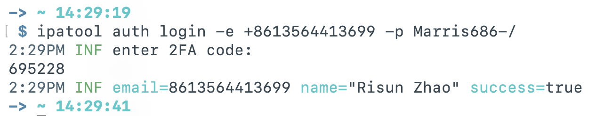

[TOC]

## ipa 下载参考文档

https://github.com/JohnxAI/ipa-download  
https://github.com/beer-psi/ipatool.ts  
https://github.com/majd/ipatool  
https://zhuanlan.zhihu.com/p/2050135468772168505

## 安装 ipa 下载工具

`brew install ipatool`

## 登录

## 下载 ipa

`ipatool search 支付宝`  
`ipatool purchase -b com.alipay.iphoneclient`  
`ipatool download -i 333206289`

`ipatool search --limit 1 TestFlight`  
`ipatool download --bundle-identifier com.apple.TestFlight`

## 查看 plist 文件中的 schema

`plutil -p Info.plist | grep -A 5 "CFBundleURLSchemes"`

## 查看 entitlements 文件中的 ulink

`codesign -d --entitlements :- NewsLite.app`

`com.apple.developer.associated-domains`

`apple-app-site-association`