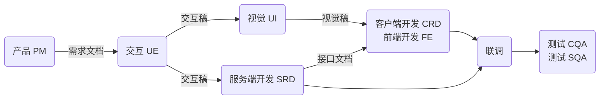
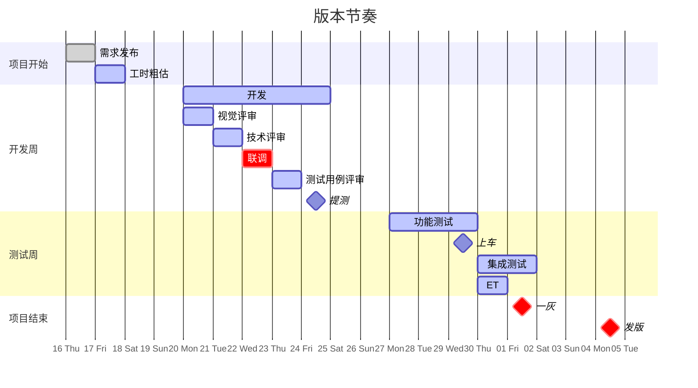
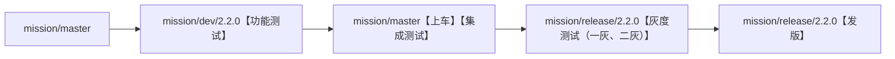

待过阿里和百度后，能够感受到大公司的工作特点，特别是员工在公司中的位置。
当我们进入一家互联网公司后，公司再大，我们最终肯定要待在某个部门，这个部门负责某块固定的业务，这个业务肯定又有对应的产品，对于普通开发者来说，就是全力支持完善这款产品。
这就要看这款产品是否成熟，若是产品成熟，功能基本都很完善了，每次迭代需求不可能有大的改动，那么我们平时做些什么呢？

## 岗位职责

| 岗位 | 职责 | 核心指标 |
| --- | --- | --- |
| 产品 PM | 需求文档 .html | 日活、月活、成本、收入 |
| 交互 UE | 交互稿 .pdf ||
| 视觉 UI | 视觉稿 .html、.sketch <br> 切图 .png ||
| 客户端开发 CRD | 开发新需求（产品需求） <br> 维护旧需求（技术需求） | App 启动时间（短） <br> 首页卡顿率（低） <br> 崩溃率（低） <br> 搜索结果页加载时间（短） <br> 存储空间占用（小） <br> 安装包体积（小） <br> 内存占用（小） |
| 前端开发 FE |||
| 服务端开发 SRD |||
| 测试 CQA、SQA | 功能测试 <br> 集成测试 ||
| 运营 OP || 日活、月活、成本、收入 |



## 技术与业务关系

**业务驱动技术发展，技术扩展业务边界。**

## 版本节奏 甘特图



## 开发流程

开发各个阶段会在不同的分支进行，一般如下：



上车具体操作如下：

```git
1. mgit checkout mission/master
2. mgit pull
3. mgit merge mission/dev/2.2.0 --no-ff -m "【上车】【2.2.0】【mission/dev/2.2.0】【mission-5968】5968的需求整体上车"
4. mgit status
5. mgit push
```
